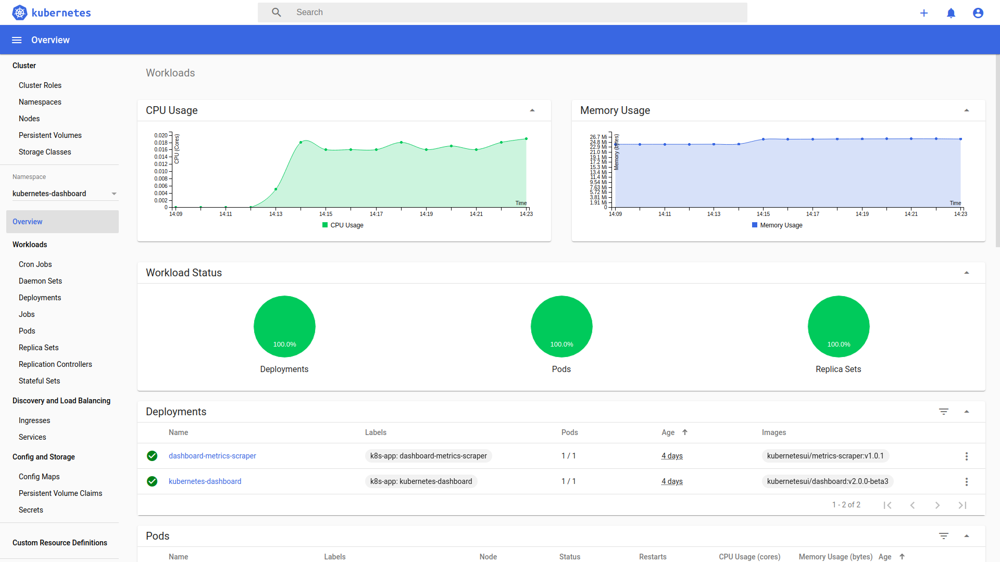

# Setup K8S Cluster on local environment (cluster)

Using:
- Virtualbox
- Vagrant

## What you need

Vagrant and Virtualbox installed.
- [Virtualbox](https://www.virtualbox.org/) 6.1
- [Vagrant](https://www.vagrantup.com/) 2.2.7

Sorry for guys working in ESN company providing 1vCPU and 4go RAM, you will need more :grin:

- At least 4vCPU
- At least 8go RAM

## Setup Cluster

You will use this template:
- [K8S Cluster](vagrant/Vagrantfile)
You can modify if needed servers settings:
- [servers.json](vagrant/servers.json)

```
cd vagrant
vagrant up
```

## Check installation 

- SSH connexion to control machine

```
cd vagrant
vagrant ssh k8s-master
```

- Check nodes

```console
[vagrant@k8s-master ~]$ kubectl get nodes
NAME                 STATUS   ROLES    AGE   VERSION
k8s-master           Ready    master   66m   v1.17.2
k8s-node-1           Ready    <none>   61m   v1.17.2
k8s-node-2           Ready    <none>   55m   v1.17.2
```

- Check that all kube-system pods are running (coredns, calico, kube-proxy...) 

```console
[vagrant@k8s-master ~]$ kubectl get pods -n kube-system
NAME                                       READY   STATUS    RESTARTS   AGE
calico-kube-controllers-5b644bc49c-nhjmn   1/1     Running   0          52m
calico-node-kwkct                          1/1     Running   0          52m
calico-node-swmgx                          1/1     Running   1          35m
coredns-6955765f44-g47wz                   1/1     Running   0          52m
coredns-6955765f44-sjd7t                   1/1     Running   0          52m
etcd-k8s-master                            1/1     Running   0          53m
kube-apiserver-k8s-master                  1/1     Running   0          53m
kube-controller-manager-k8s-master         1/1     Running   0          53m
kube-proxy-95wlx                           1/1     Running   1          35m
kube-proxy-hnxsq                           1/1     Running   0          52m
kube-scheduler-k8s-master                  1/1     Running   0          53m
```

## Test Ingress

If you want to use and test Ingress resources, 

- Apply an example with a deployment, a service, and an ingress.

```console
[vagrant@k8s-master ~]$ kubectl apply -f https://raw.githubusercontent.com/dvps-ad/k8s-cluster/master/demo/sample.yaml
service/my-example created
deployment.apps/example-deployment created
ingress.extensions/my-ingress created
```

- Get ingress host and ip.

```console
[vagrant@k8s-master ~]$ kubectl get ing
NAME          HOSTS          ADDRESS        PORTS   AGE
my-ingress    mywebserver    10.100.71.58   80      103m
```

- Add it at the bottom of /etc/hosts

```console
[vagrant@k8s-master ~]$ vi /etc/hosts
[vagrant@k8s-master ~]$ cat /etc/hosts
127.0.0.1       localhost
10.100.71.58    mywebserver
192.168.50.10   k8s-master
192.168.50.11   k8s-node-1
192.168.50.12   k8s-node-2
```

- Enjoy

```console
[vagrant@k8s-master ~]$ curl http://mywebserver
Hello, world!
Version: 2.0.0
Hostname: example-deployment-68747f8875-wnnxs
[vagrant@k8s-master ~]$ curl http://mywebserver
Hello, world!
Version: 2.0.0
Hostname: example-deployment-68747f8875-fssfk
[vagrant@k8s-master ~]$ curl http://mywebserver
Hello, world!
Version: 2.0.0
Hostname: example-deployment-68747f8875-jkxlg
```

## Setup Kubernetes dashboard

In order to setup the dashboard you need:

- Get the token for user-admin (because you will access the dashboard outside from the cluster, from your host)

```console
[vagrant@k8s-master ~]$ kubectl -n kubernetes-dashboard describe secret $(kubectl -n kubernetes-dashboard get secret | grep admin-user | awk '{print $1}')
...
...
Data
====
ca.crt:     1025 bytes
namespace:  7 bytes
token:      eyJhbGciOiJSUzI1NiIsImtpZCI6IlNkUFVsZjZrbWtYdzVkSG1qVldFVjFteTVXcnduRTU2UHNSTXVZLUFiNjgifQ.eyJpc3MiOiJrdWJlcm5ldGVzL3NlcnZpY2VhY2NvdW50Iiwia3ViZXJuZXRlcy5pby9zZXJ2aWNlYWNjb3VudC9uYW1lc3BhY2UiOiJkZWZhdWx0Iiwia3ViZXJuZXRlcy5pby9zZXJ2aWNlYWNjb3VudC9zZWNyZXQubmFtZSI6ImRhc2hib2FyZC1hZG1pbi1zYS10b2tlbi1oNzc0aCIsImt1YmVybmV0ZXMuaW8vc2VydmljZWFjY291bnQvc2VydmljZS1hY2NvdW50Lm5hbWUiOiJkYXNoYm9hcmQtYWRtaW4tc2EiLCJrdWJlcm5ldGVzLmlvL3NlcnZpY2VhY2NvdW50L3NlcnZpY2UtYWNjb3VudC51aWQiOiI0YWY5ZTdkYy01ODQ2LTQ1MGEtOWRhMi1jNGFhYjBmMzBmZjIiLCJzdWIiOiJzeXN0ZW06c2VydmljZWFjY291bnQ6ZGVmYXVsdDpkYXNoYm9hcmQtYWRtaW4tc2EifQ.VD83QLmFhEKWfwf26O97AruDCFfj0w4cbdZ4NgSYoe_VUcsxqNYUjOyrvDcR_T1f2F3KfzbrV5j2uGssVD-LDsiqYj_O3WWDblVDG17bdN59f4CzECKPlC-RbHvsn5EX9Fru7t6b2O_Tln_Vcz-83pcdrZOI3qEzJ8NLoPQuL1U3pJPbpGfaZpNCiT0OZwZZdLz5A4e_BpkIOZG5oQdvPFufJlb88gsexmnmyFyht7u7SzoJlDq2qcX5RloJw0eUFBhYCKeZMyT2O5RBoCjHFdDBxixn2ZuWUujCNsrLD4CedoKEAEN4pMBr2wsJDO-7EM3KKyAf92h10ICNy6YRmg
```

- Copy the **token** from your console

- Start dashboard proxy, don't forget **--address=0.0.0.0** option.

```console
[vagrant@k8s-master ~]$ kubectl proxy --address=0.0.0.0
Starting to serve on [::]:8001
```


- Connect from your host to this address: http://localhost:8081/api/v1/namespaces/kubernetes-dashboard/services/https:kubernetes-dashboard:/proxy/

- Past the token


- And click on **Sign In** ! Enjoy



## More about this cluster

### Components

- Control machine is **k8s-master**
- Docker is installed, with systemd
- CNI used is Calico
- Nginx Ingress
- A bare metal load-balancer : MetalLB

### About Calico

Some difficulties with Flannel and Virtualbox. Calico works well.

:warning: Default CIDR 192.168.0.0/16 create some conflicts with Virtualbox, 
So **kubeadm init** is done with option **--pod-network-cidr=172.16.0.0/16**

### About MetalLB

Kubernetes does not offer an implementation of network load-balancers (Services of type LoadBalancer) for bare metal clusters.
If you’re not running on a supported IaaS platform (GCP, AWS, Azure…), LoadBalancers will remain in the “pending” state indefinitely when created.

```console
[root@localhost temp]# kubectl get services
NAME       TYPE           CLUSTER-IP     EXTERNAL-IP   PORT(S)          AGE
my-nginx   LoadBalancer   10.111.43.88   <pending>     80:31730/TCP     22m
```

With MetalLB, it works ! https://metallb.universe.tf/

Range IPs for MetalLB is configured 192.168.50.240-192.168.50.250. See [vagrant/install-k8s-master.sh](vagrant/install-k8s-master.sh) 
